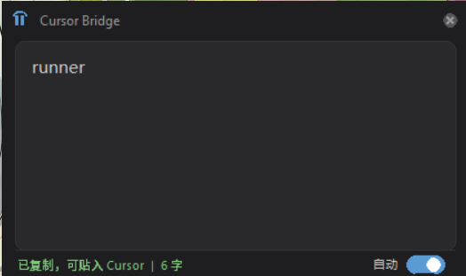

# Cursor Bridge

[](https://opensource.org/licenses/MIT)
[](https://www.python.org/)
[](https://www.microsoft.com/windows)
[](https://github.com/winter2815651645-collab/cursor-bridge/releases)

A Windows clipboard bridge that fixes CJK text encoding when pasting into [Cursor](https://cursor.com) editor.



## What It Does

Copy Chinese/CJK text from anywhere → Cursor Bridge auto-fixes encoding → paste into Cursor without garbled characters.

Cursor's Chromium WebView mangles CJK clipboard text in two ways:

| Pattern | What happens | Recovery |
|---------|-------------|----------|
| **A** | UTF-8 bytes expanded into UTF-16LE with `0x00` alternation | Reverse byte-expansion |
| **B** | Raw UTF-8 bytes stuffed into `CF_UNICODETEXT` | Decode as UTF-8 + alpha ratio guard (>50%) |

## Features

- **Auto monitor** — polls clipboard every 500ms, fixes encoding on the fly
- **Win+Shift+V** — manual hotkey to fix current clipboard content
- **System tray** — runs in background with context menu (pause, about, exit)
- **Popup window** — dark Slate theme, toggle auto-fix on/off
- **Zero dependencies** — Python 3 stdlib only (tkinter + ctypes)

## Installation

```bash
# Download cursor_bridge.pyw
# Run it (no console window):
pythonw cursor_bridge.pyw
```

### Auto-start on boot

1. Place `cursor-bridge-startup.vbs` **in the same folder** as `cursor_bridge.pyw`
2. Create a shortcut in your Startup folder:

```
%APPDATA%\Microsoft\Windows\Start Menu\Programs\Startup\
```

The shortcut target should point to:

```
wscript.exe "C:\path\to\cursor-bridge-startup.vbs"
```

> **Note for non-English Windows users:** The VBS file contains only ASCII. If you create your own VBS wrapper, save it as **ANSI/ASCII**, not UTF-8. VBScript does not support UTF-8 and will fail with "Invalid character" errors on Chinese/Japanese/Korean Windows.

## Requirements

- Windows 10/11
- Python 3.10+

No pip install needed. Uses only tkinter and ctypes from the standard library.

## How It Works

```
Any app (browser, WeChat, Notepad...)
    │  Ctrl+C
    ▼
Windows Clipboard (CF_UNICODETEXT)
    │  Cursor Bridge polls every 500ms
    ▼
Encoding detection (Pattern A vs Pattern B)
    │  Recovery
    ▼
Clipboard written back with correct UTF-16LE
    │  Ctrl+V
    ▼
Cursor editor — Chinese displays correctly
```

## Tech Stack

| Layer | Tech |
|-------|------|
| UI | tkinter (tray icon + popup) |
| Clipboard | Win32 API via ctypes (`OpenClipboard`, `GetClipboardData`, `SetClipboardData`) |
| Hotkey | `GetAsyncKeyState` polling |
| Tray icon | `Shell_NotifyIconW` + GDI custom drawing |
| Encoding | Pure Python byte-level recovery |

## Contributing

See [CONTRIBUTING.md](CONTRIBUTING.md).

## License

MIT — see [LICENSE](LICENSE).

## Author

[winter2815651645-collab](https://github.com/winter2815651645-collab)
